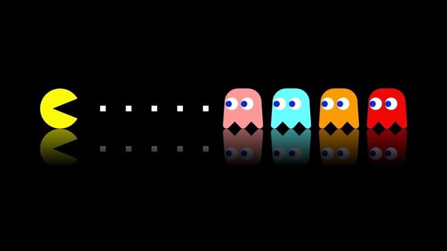

# Hello World!, I'm Aziz, a Tunisian Full Stack Web Developer 👋🏼:
🛜 currently working on my own [webpage](https://aziz-toulgui-portfolio.netlify.app/) 👨🏼‍🎓 studying  Buisness computing in FSEGN 👨🏼‍💻 i'm a hard working and ambitious full stack developer 🎬 just started out on my own trying to get better everyday

# 💻 Tech Stack:

                       

<picture>
  <source media="(prefers-color-scheme: dark)" srcset="https://raw.githubusercontent.com/AzizToulgui/AzizToulgui/output/github-snake-dark.svg" />
  <source media="(prefers-color-scheme: light)" srcset="https://raw.githubusercontent.com/AzizToulgui/AzizToulgui/output/github-snake.svg" />
  
</picture>
